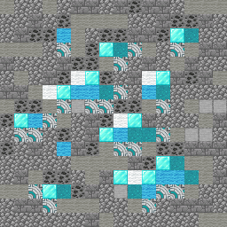

    
    <h1>img2minecraft</h1>

<h4 align="center">Convert the pixels of any image to minecraft blocks</h4>

    <a href="#features">Features</a> - 
    <a href="#usage">Usage</a> -
    <a href="#deployment">Deployment</a>

## Features
This tools converts the pixels of any image
to the minecraft block of the closest color.

## Usage
1. Click on the upload button
2. Choose an image file to upload
3. Click on the generated image to download the result

## Development

1. `git clone` this repository.
2. `cd img2minecraft`
3. `npm install`
4. `npm run dev`

**All the textures provided are owned by Mojang Studios. I do not claim any rights on these, and all the textures
provided are used only for demonstration purposes!**

**This is not an official Minecraft product and not approved by or associated with Mojang.**